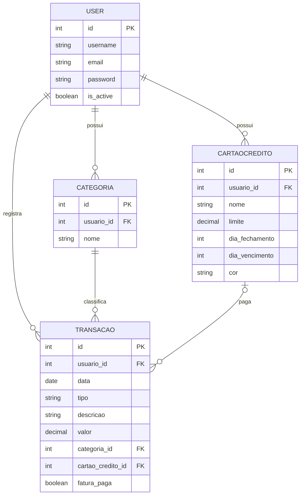

# Ordo Finance

Sistema de gestão financeira pessoal desenvolvido com foco em arquitetura orientada a serviços e escalabilidade.

## Visão Geral

A aplicação permite o controle de receitas e despesas, categorização de lançamentos e visualização de balanços financeiros. O projeto foi estruturado para demonstrar a coexistência de um monolito robusto (Django) conectado a um banco de dados na nuvem (PostgreSQL) com microserviços especializados (FastAPI), utilizando conteinerização para orquestração do ambiente.

## Arquitetura do Sistema

O sistema é composto pelos seguintes serviços:

*   **App Principal (Django):** Responsável pelo gerenciamento de usuários, regras de negócio principais (CRUD de transações), autenticação e renderização da interface (Server-Side Rendering).
*   **Microserviço de Relatórios (FastAPI):** Unidade isolada para processamento de tarefas intensivas (geração de PDF e exportação de dados), comunicando-se com o Core via API HTTP.
*   **Banco de Dados (PostgreSQL):** Armazenamento relacional centralizado.

## Modelo Entidade-Relacionamento (ER)

Abaixo está a modelagem do banco de dados na nuvem gerado pelo Django (focado no aplicativo *Finanças*):



## Requisitos Funcionais

*   **RF01:** Autenticação segura com login/logout
*   **RF02:** CRUD de transações (receitas e despesas) com data, descrição, valor, categoria e cartão opcional
*   **RF03:** Gerenciamento de cartões de crédito (nome, limite, fechamento, vencimento, cor)
*   **RF04:** Categorização personalizada de transações por usuário
*   **RF05:** Dashboard com saldo total, resumo mensal e últimos 5 lançamentos
*   **RF06:** Histórico completo de transações com paginação
*   **RF07:** Isolamento de dados por usuário (sem vazamento entre contas)
*   **RF08:** Exportação de relatórios em PDF via microserviço

## Requisitos Não Funcionais

*   **RNF01:** Arquitetura híbrida (Django monolito + FastAPI microserviço)
*   **RNF02:** Backend em Python 3.12+ com Django 5.x e FastAPI
*   **RNF03:** Frontend Server-Side Rendering (Django Templates + TailwindCSS + Alpine.js)
*   **RNF04:** Rotas protegidas por autenticação obrigatória
*   **RNF05:** Integridade referencial com proteção de histórico (PROTECT) e deleção em cascata (CASCADE)
*   **RNF06:** Paginação de listagens (máximo 10 itens/página)
*   **RNF07:** Infraestrutura containerizada via Docker Compose com banco de dados remoto (Supabase/PostgreSQL) para escalabilidade

## Tecnologias Utilizadas

*   **Backend:** Python 3.12+, Django 5.x, FastAPI
*   **Frontend:** TailwindCSS, Alpine.js
*   **Infraestrutura:** Docker, Docker Compose
*   **Banco de Dados:** PostgreSQL (nuvem via Supabase)

## Como Executar o Projeto

### Pré-requisitos

*   Docker e Docker Compose instalados
*   Python 3.12+ (para execução local opcional)
*   Git

### Passo a Passo (Via Docker)

1.  Clone o repositório:
    ```bash
    git clone https://github.com/migueldufloth/ordo-finance.git
    cd ordo-finance
    ```
2. Crie o arquivo `.env` na raiz do projeto com base nas suas credenciais do banco de dados na nuvem (`DATABASE_URL`).

3.  Suba os containers da aplicação:
    ```bash
    docker-compose up --build
    ```

4.  Acesse a aplicação principal em: `http://localhost:8000`

---

### Execução Local (Sem Docker)

Caso necessite rodar localmente para testes rápidos:
1. Crie e ative um ambiente virtual: `python -m venv venv`
2. Instale as dependências: `pip install -r requirements.txt`
3. Configure a `DATABASE_URL` no `.env`
4. Execute: `python manage.py runserver`
