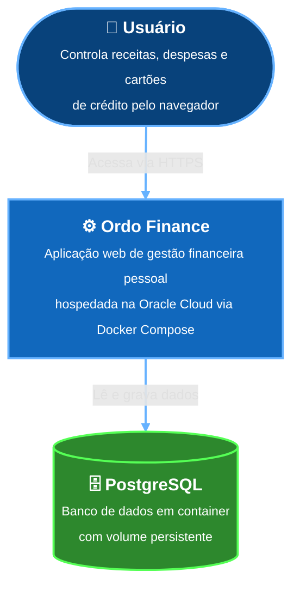
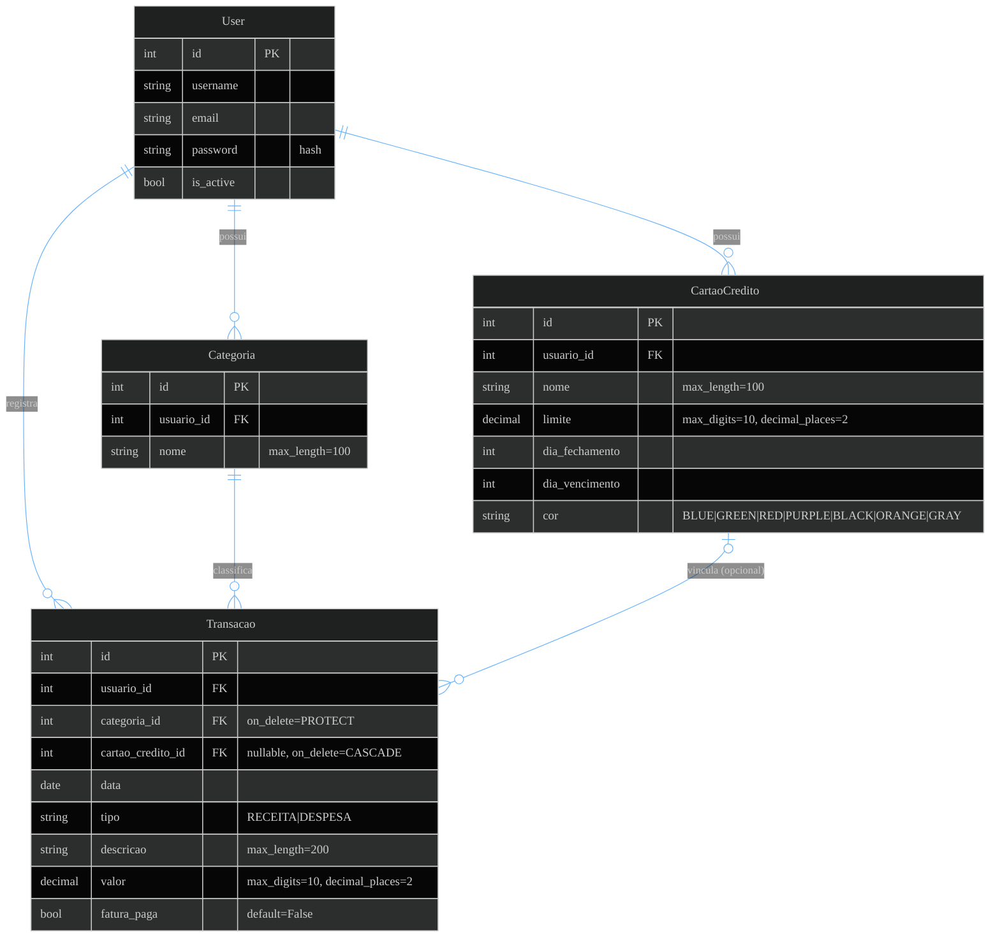

# Ordo Finance

Sistema de gestão financeira pessoal com arquitetura híbrida: monolito Django para o core da aplicação e microserviço FastAPI para relatórios. Totalmente containerizado via Docker e implantável no Render.com.

## Visão Geral

A aplicação permite controle de receitas e despesas, categorização de lançamentos, gerenciamento de cartões de crédito e visualização de balanços financeiros. O projeto demonstra a coexistência de um monolito robusto (Django + Gunicorn) com um microserviço especializado (FastAPI + Uvicorn), utilizando conteinerização Docker para orquestração dos ambientes de desenvolvimento e produção.

---

## Arquitetura do Sistema

### Nível 1: Contexto

Visão de alto nível: quem usa o sistema e com o que ele se comunica.



---

### Nível 2: Containers

Decomposição dos serviços que compõem o sistema em produção.


---

### Nível 3: Componentes

Estrutura interna do monolito Django, mapeando os arquivos reais do repositório.


---

### Modelo de Dados (ER)

Estrutura completa das tabelas gerenciadas pelo Django ORM, com todos os campos, tipos e relacionamentos.



> **Regras de integridade:** deletar uma `Categoria` que possui transações é bloqueado (`PROTECT`). Deletar um `CartaoCredito` remove em cascata suas transações vinculadas (`CASCADE`). Deletar um `User` remove em cascata todos os seus dados.

---

## Requisitos Funcionais

| ID | Requisito |
|----|-----------|
| RF01 | Autenticação segura com login e logout |
| RF02 | CRUD de transações com data, descrição, valor, categoria e cartão opcional |
| RF03 | Gerenciamento de cartões de crédito (nome, limite, fechamento, vencimento, cor) |
| RF04 | Categorização personalizada de transações por usuário |
| RF05 | Dashboard com saldo total, resumo mensal e últimos 5 lançamentos |
| RF06 | Histórico completo de transações com paginação (10 itens/página) |
| RF07 | Isolamento total de dados por usuário |
| RF08 | Exportação de relatórios em PDF via microserviço *(planejado)* |

## Requisitos Não Funcionais

| ID | Requisito |
|----|-----------|
| RNF01 | Arquitetura híbrida: Django monolito + FastAPI microserviço |
| RNF02 | Python 3.12+ · Django 5.x · FastAPI |
| RNF03 | Frontend SSR: Django Templates + TailwindCSS + Alpine.js |
| RNF04 | Todas as rotas protegidas por autenticação obrigatória |
| RNF05 | Integridade referencial: PROTECT para categorias, CASCADE para cartões |
| RNF06 | Infraestrutura containerizada via Docker Compose |

---

## Tecnologias

| Camada | Tecnologias |
|--------|------------|
| Backend | Python 3.12 · Django 5.x · FastAPI |
| Servidores | Gunicorn (Django) · Uvicorn (FastAPI) · WhiteNoise + Brotli (assets) |
| Frontend | Django Templates · TailwindCSS · Alpine.js |
| Banco de Dados | PostgreSQL · psycopg2 · dj-database-url |
| Infraestrutura | Docker · Docker Compose · Oracle Cloud Always Free |

---

## Deploy na Oracle Cloud (Always Free)

Toda a aplicação sobe via `docker-compose.prod.yml` em uma VM gratuita e permanente da Oracle Cloud. O banco de dados roda como container com volume persistente — sem serviços externos.

### 1. Criar a VM na Oracle Cloud

1. Acesse [cloud.oracle.com](https://cloud.oracle.com) e crie uma conta (Always Free não exige cartão de crédito em uso).
2. Crie uma **Compute Instance** com as configurações Always Free:
   - Shape: `VM.Standard.A1.Flex` (ARM) — até 4 OCPUs e 24 GB RAM, ou `VM.Standard.E2.1.Micro` (AMD)
   - Imagem: **Ubuntu 22.04**
3. Salve a chave SSH gerada e anote o IP público da VM.

### 2. Configurar a VM

Conecte via SSH e instale Docker:

```bash
ssh ubuntu@<IP_DA_VM>

# Instalar Docker
curl -fsSL https://get.docker.com | sh
sudo usermod -aG docker ubuntu
newgrp docker

# Instalar Docker Compose plugin
sudo apt-get install -y docker-compose-plugin
docker compose version
```

Libere as portas no Security List da Oracle (VCN → Security Lists → Ingress Rules):

| Porta | Protocolo | Origem |
|-------|-----------|--------|
| 22    | TCP       | 0.0.0.0/0 (SSH) |
| 8000  | TCP       | 0.0.0.0/0 (Django) |
| 8001  | TCP       | 0.0.0.0/0 (FastAPI) |

E no firewall da própria VM:

```bash
sudo iptables -I INPUT -p tcp --dport 8000 -j ACCEPT
sudo iptables -I INPUT -p tcp --dport 8001 -j ACCEPT
sudo netfilter-persistent save
```

### 3. Subir a Aplicação

```bash
# Clonar o repositório
git clone <URL_DO_REPO>
cd ordo-finance

# Criar o arquivo de variáveis de ambiente
cat > .env <<EOF
POSTGRES_DB=ordo
POSTGRES_USER=postgres
POSTGRES_PASSWORD=suasenhaforte
SECRET_KEY=suachavesecreta
ALLOWED_HOSTS=*
EOF

# Subir todos os containers (DB + Django + FastAPI)
docker compose -f docker-compose.prod.yml up -d --build
```

A aplicação estará disponível em `http://<IP_DA_VM>:8000`.

### Comandos Úteis

```bash
docker compose -f docker-compose.prod.yml logs -f          # Ver logs
docker compose -f docker-compose.prod.yml ps               # Status dos containers
docker compose -f docker-compose.prod.yml exec web python manage.py createsuperuser
docker compose -f docker-compose.prod.yml pull && docker compose -f docker-compose.prod.yml up -d --build  # Atualizar
```

---

## Execução Local

### Via Docker Compose (recomendado)

```bash
docker-compose up --build
```

Serviços disponíveis:

| Serviço | URL |
|---------|-----|
| Django (app principal) | http://localhost:8000 |
| FastAPI (microserviço) | http://localhost:8001 |
| PostgreSQL | localhost:5432 |

### Sem Docker

```bash
python -m venv venv
source venv/bin/activate       # Windows: venv\Scripts\activate
pip install -r requirements.txt
# configure DATABASE_URL no .env ou exporte a variável
python manage.py migrate
python manage.py createsuperuser
python manage.py runserver
```
