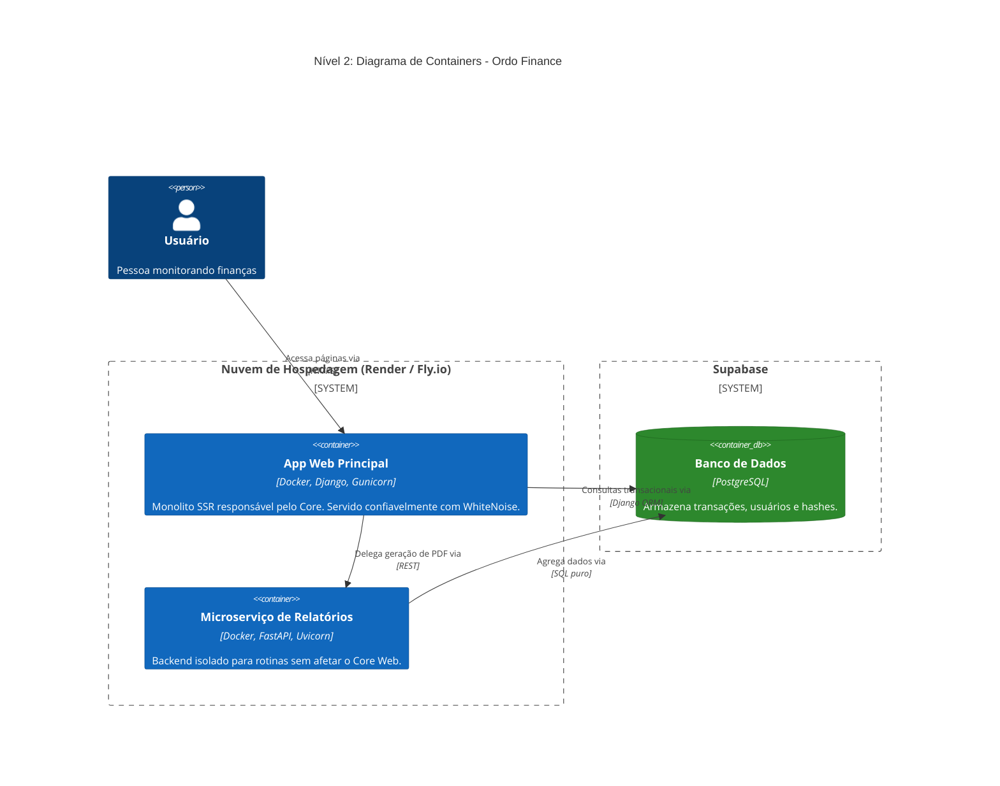
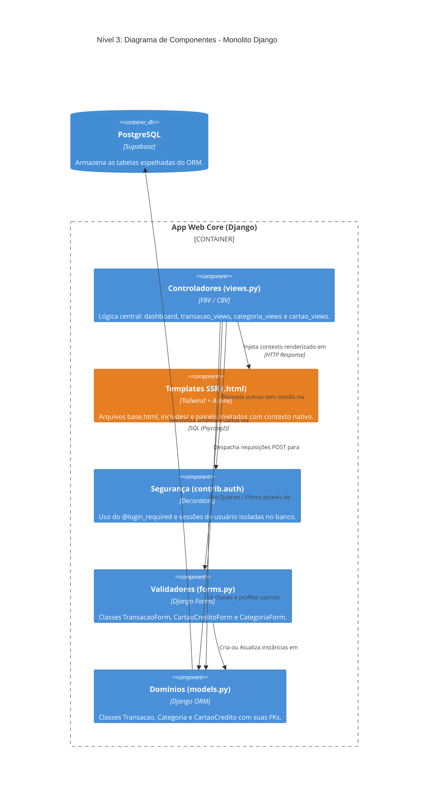

# Ordo Finance

Sistema de gestão financeira pessoal desenvolvido com foco em arquitetura orientada a serviços e escalabilidade.

## Visão Geral

A aplicação permite o controle de receitas e despesas, categorização de lançamentos e visualização de balanços financeiros. O projeto foi estruturado para demonstrar a coexistência de um monolito robusto (Django) conectado a um banco de dados na nuvem (PostgreSQL) com microserviços especializados (FastAPI), utilizando conteinerização para orquestração do ambiente.

## Estrutura de Produção e Arquitetura do Sistema

O sistema é composto de serviços dockerizados independentes para facilitar o *deploy* em plataformas na nuvem como **Render.com** ou **Railway**.

*   **App Principal (Django Monolito):** Responsável pelo gerenciamento de usuários, regras de negócio principais e renderização da interface. Em produção, ele opera atrás do **Gunicorn** (multi-workers) e gerencia ativos estáticos através do **WhiteNoise**, impulsionado por um `entrypoint.sh` seguro que realiza as rotinas de banco.
*   **Microserviço (FastAPI):** Unidade focada no isolamento de tarefas intensivas, executado assincronamente através do servidor **Uvicorn**, comunicando-se com o Core via API HTTP.
*   **Banco de Dados (PostgreSQL - Supabase):** Armazenamento relacional centralizado servido como PaaS gratuito.

## Arquitetura C4

Os diagramas abaixo utilizam o padrão **C4 Model** (Context, Container, Component) suportado nativamente pelo Mermaid no GitHub para representar como a aplicação funciona e quem são os envolvidos.

### Nível 1: Diagrama de Contexto

Visão de alto nível mostrando o sistema Ordo Finance, o usuário principal e o provedor de nuvem (Supabase).

```mermaid
C4Context
    title Nível 1: Diagrama de Contexto de Sistema - Ordo Finance
    
    Person(usuario, "Usuário do Sistema", "Acompanha suas finanças, receitas e cartões.")
    
    System(ordo, "Ordo Finance", "Plataforma instalada em PaaS (Ex: Render.com). Entregue via Docker.")
    
    SystemExt(supabase, "Supabase (PostgreSQL)", "PaaS Database que hospeda o Postgres para armazenamento seguro na nuvem.")

    Rel_R(usuario, ordo, "Acessa a interface web via", "HTTPS")
    Rel_R(ordo, supabase, "Lê e grava dados via", "PostgreSQL Protocol")
    
    UpdateElementStyle(usuario, $fontColor="white", $bgColor="#08427B", $borderColor="#052E56")
    UpdateElementStyle(ordo, $fontColor="white", $bgColor="#1168BD", $borderColor="#0B4884")
    UpdateElementStyle(supabase, $fontColor="white", $bgColor="#555555", $borderColor="#333333")
```

### Nível 2: Diagrama de Containers

Decomposição interna do sistema, detalhando o monolito principal (Django), o banco de dados e o microserviço projetado.



### Nível 3: Diagrama de Componentes (Aplicação Web Principal)

Decomposição interna do Container "Aplicação Web Principal", mapeando exatamente como o código do Django está estruturado no repositório.



## Requisitos Funcionais

*   **RF01:** Autenticação segura com login/logout
*   **RF02:** CRUD de transações (receitas e despesas) com data, descrição, valor, categoria e cartão opcional
*   **RF03:** Gerenciamento de cartões de crédito (nome, limite, fechamento, vencimento, cor)
*   **RF04:** Categorização personalizada de transações por usuário
*   **RF05:** Dashboard com saldo total, resumo mensal e últimos 5 lançamentos
*   **RF06:** Histórico completo de transações com paginação
*   **RF07:** Isolamento de dados por usuário (sem vazamento entre contas)
*   **RF08:** Exportação de relatórios em PDF via microserviço

## Requisitos Não Funcionais

*   **RNF01:** Arquitetura híbrida (Django monolito + FastAPI microserviço)
*   **RNF02:** Backend em Python 3.12+ com Django 5.x e FastAPI
*   **RNF03:** Frontend Server-Side Rendering (Django Templates + TailwindCSS + Alpine.js)
*   **RNF04:** Rotas protegidas por autenticação obrigatória
*   **RNF05:** Integridade referencial com proteção de histórico (PROTECT) e deleção em cascata (CASCADE)
*   **RNF06:** Paginação de listagens (máximo 10 itens/página)
*   **RNF07:** Infraestrutura containerizada via Docker Compose com banco de dados remoto (Supabase/PostgreSQL) para escalabilidade

## Tecnologias Utilizadas

*   **Backend:** Python 3.12+, Django 5.x, FastAPI
*   **Servidores de Produção:** Gunicorn (Django), Uvicorn (FastAPI), WhiteNoise (Assets HD)
*   **Frontend:** TailwindCSS, Alpine.js
*   **Infraestrutura e Deploy:** Docker (Imagens Multi-container), Render.com / Railway
*   **Banco de Dados:** PostgreSQL Cloud (Supabase)

## Como Fazer o Deploy para Produção (Render.com)

Graças ao encapsulamento em Docker puro e configuração universal das Variáveis de Ambiente, a plataforma do **Render.com** (que possui *Tier Gratuito*) é a nossa opção de infraestrutura Cloud recomendada!

### Passo a Passo

1. Tenha o `DATABASE_URL` do seu projeto Supabase em mãos.
2. Acesse sua conta no **Render.com** e crie um novo **Web Service**.
3. Vincule seu repositório do Github contendo o Ordo Finance.
4. Em *Environment*, selecione **Docker**. O Render fará a leitura automática e construirá o app pelas diretrizes do seu `Dockerfile`.
5. Preencha as Variáveis (*Environment Variables*):
   - `DATABASE_URL` = [A connection string que você obteve no Supabase]
   - `SECRET_KEY` = [Gere um passkey/hash aleatório para proteger seu Django]
   - `DEBUG` = `False`
   - `ALLOWED_HOSTS` = `*`
6. Clique em **Deploy**! A plataforma subirá instâncias Linux e em minutos você terá acesso seguro via `https://ordo-finance-suaconta.onrender.com`.

---

## Como Executar o Projeto (Localmente para Testes)

### Via Docker Compose (Recomendado)

O projeto possui de forma nativamente acoplada um `docker-compose.prod.yml` arquitetado para Nuvem e também suporta devs locais.

1. Clone o projeto e crie um arquivo `.env` na raiz informando o `DATABASE_URL`.
2. Rode no bash:
    ```bash
    docker-compose up --build
    ```

4.  Acesse a aplicação principal em: `http://localhost:8000`

---

### Execução Local (Sem Docker)

Caso necessite rodar localmente para testes rápidos:
1. Crie e ative um ambiente virtual: `python -m venv venv`
2. Instale as dependências: `pip install -r requirements.txt`
3. Configure a `DATABASE_URL` no `.env`
4. Execute: `python manage.py runserver`
