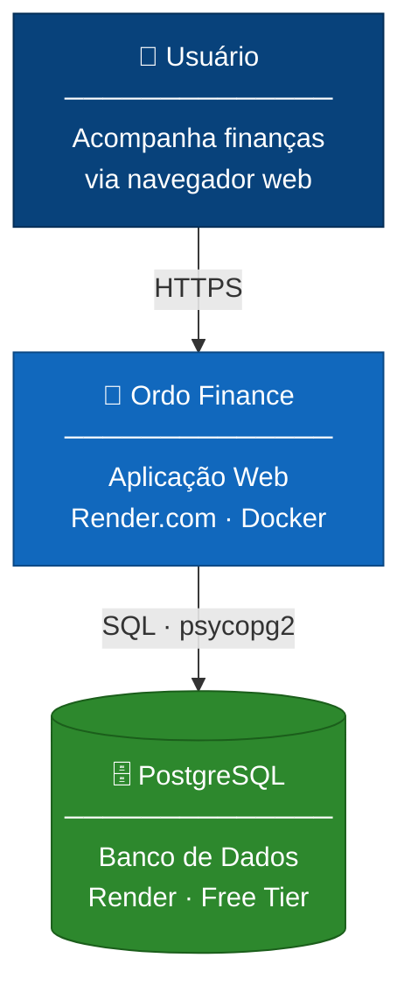
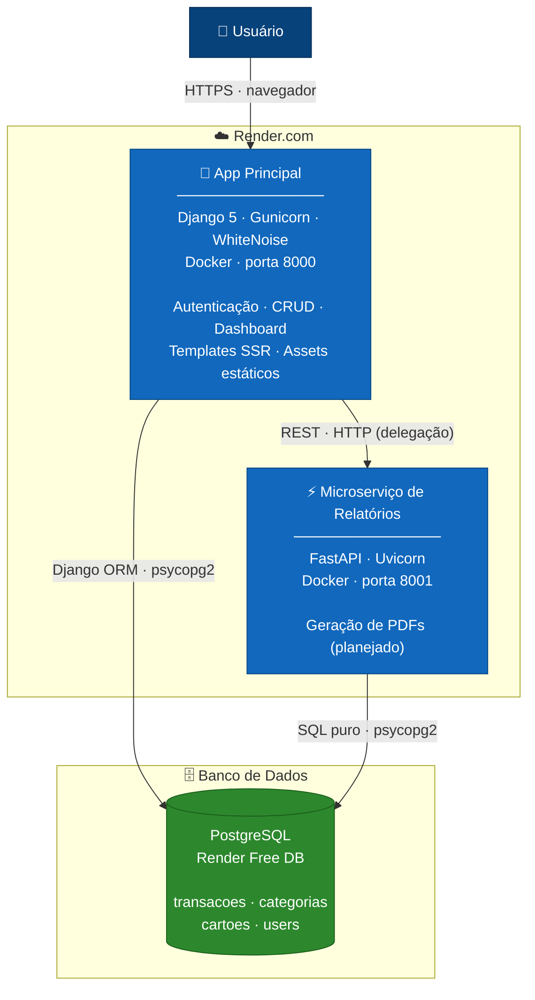
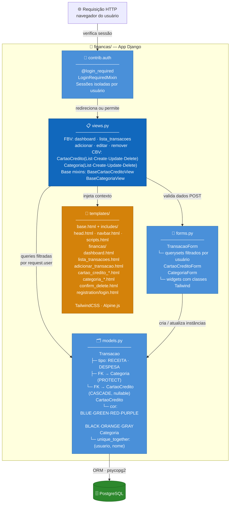
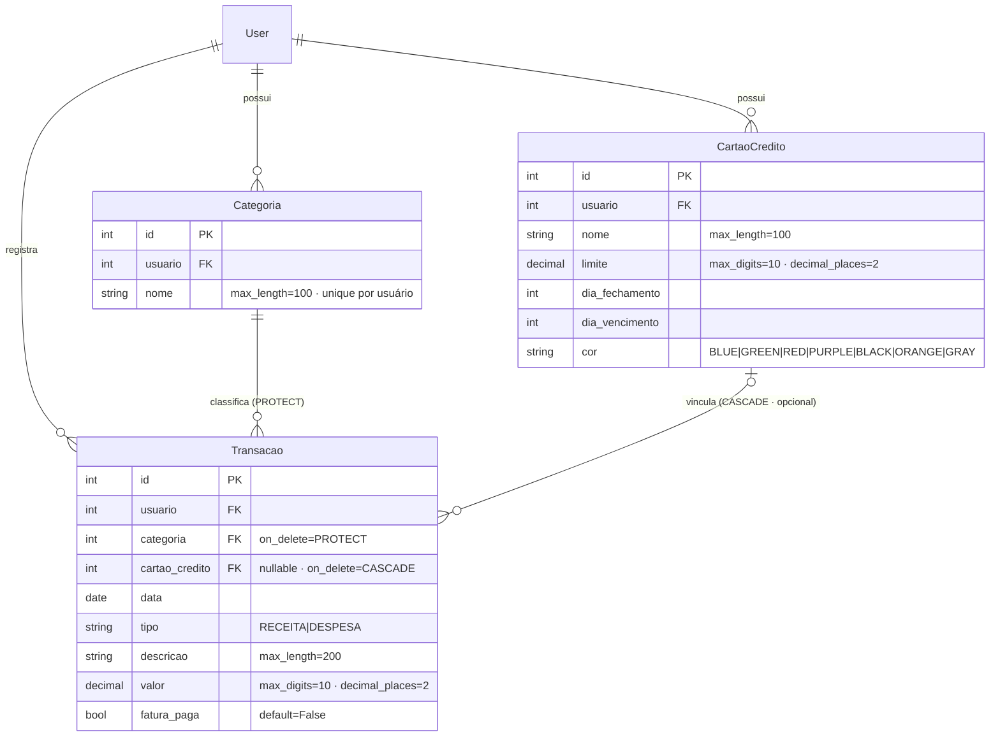

# Ordo Finance

Sistema de gestão financeira pessoal com arquitetura híbrida: monolito Django para o core da aplicação e microserviço FastAPI para relatórios. Totalmente containerizado via Docker e implantável no Render.com.

## Visão Geral

A aplicação permite controle de receitas e despesas, categorização de lançamentos, gerenciamento de cartões de crédito e visualização de balanços financeiros. O projeto demonstra a coexistência de um monolito robusto (Django + Gunicorn) com um microserviço especializado (FastAPI + Uvicorn), utilizando conteinerização Docker para orquestração dos ambientes de desenvolvimento e produção.

---

## Arquitetura do Sistema

### Nível 1 — Contexto

Visão de alto nível: quem usa o sistema e com o que ele se comunica.



---

### Nível 2 — Containers

Decomposição dos serviços que compõem o sistema em produção.



---

### Nível 3 — Componentes (App Django)

Estrutura interna do monolito Django, mapeando os arquivos reais do repositório.



---

### Modelo de Dados (ER)

Relacionamentos e campos das tabelas gerenciadas pelo Django ORM.



---

## Requisitos Funcionais

| ID | Requisito |
|----|-----------|
| RF01 | Autenticação segura com login e logout |
| RF02 | CRUD de transações com data, descrição, valor, categoria e cartão opcional |
| RF03 | Gerenciamento de cartões de crédito (nome, limite, fechamento, vencimento, cor) |
| RF04 | Categorização personalizada de transações por usuário |
| RF05 | Dashboard com saldo total, resumo mensal e últimos 5 lançamentos |
| RF06 | Histórico completo de transações com paginação (10 itens/página) |
| RF07 | Isolamento total de dados por usuário |
| RF08 | Exportação de relatórios em PDF via microserviço *(planejado)* |

## Requisitos Não Funcionais

| ID | Requisito |
|----|-----------|
| RNF01 | Arquitetura híbrida: Django monolito + FastAPI microserviço |
| RNF02 | Python 3.12+ · Django 5.x · FastAPI |
| RNF03 | Frontend SSR: Django Templates + TailwindCSS + Alpine.js |
| RNF04 | Todas as rotas protegidas por autenticação obrigatória |
| RNF05 | Integridade referencial: PROTECT para categorias, CASCADE para cartões |
| RNF06 | Infraestrutura containerizada via Docker Compose |

---

## Tecnologias

| Camada | Tecnologias |
|--------|------------|
| Backend | Python 3.12 · Django 5.x · FastAPI |
| Servidores | Gunicorn (Django) · Uvicorn (FastAPI) · WhiteNoise + Brotli (assets) |
| Frontend | Django Templates · TailwindCSS · Alpine.js |
| Banco de Dados | PostgreSQL · psycopg2 · dj-database-url |
| Infraestrutura | Docker · Docker Compose · Render.com |

---

## Deploy no Render.com (Free Tier)

O projeto está **100% pronto** para deploy no Render. O `entrypoint.sh` executa automaticamente as migrations, coleta os arquivos estáticos e inicia o Gunicorn.

### Passo a Passo

1. Acesse [render.com](https://render.com) e crie um **PostgreSQL** gratuito. Copie a *Internal Database URL*.
2. Crie um novo **Web Service** e vincule este repositório.
3. Em *Settings*, selecione **Docker** como ambiente de build.
4. Configure as variáveis de ambiente:

   | Variável | Valor |
   |----------|-------|
   | `DATABASE_URL` | URL interna do PostgreSQL criado no passo 1 |
   | `SECRET_KEY` | Hash aleatório e seguro |
   | `DEBUG` | `False` |
   | `ALLOWED_HOSTS` | `*` ou seu domínio |

5. Clique em **Deploy**. Em alguns minutos a aplicação estará disponível em `https://seu-servico.onrender.com`.

> **Atenção:** No free tier, o web service dorme após 15 minutos de inatividade e leva ~30s para acordar. O PostgreSQL gratuito expira em 90 dias.

---

## Execução Local

### Via Docker Compose (recomendado)

```bash
docker-compose up --build
```

Serviços disponíveis:

| Serviço | URL |
|---------|-----|
| Django (app principal) | http://localhost:8000 |
| FastAPI (microserviço) | http://localhost:8001 |
| PostgreSQL | localhost:5432 |

### Sem Docker

```bash
python -m venv venv
source venv/bin/activate       # Windows: venv\Scripts\activate
pip install -r requirements.txt
# configure DATABASE_URL no .env ou exporte a variável
python manage.py migrate
python manage.py createsuperuser
python manage.py runserver
```
